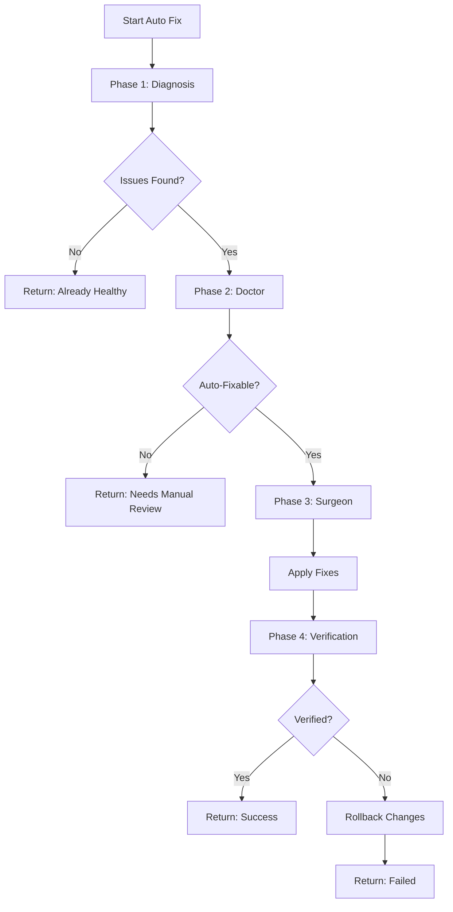

# 🤖 Auto Features - Autonomous Operations Guide

## Overview

Repo-Doctor provides four powerful automation features that work together to maintain repository health, enforce standards, and accelerate development workflows:

1. **Auto Sync** - Automatic multi-repository synchronization
2. **Auto Test** - Automated testing and validation
3. **Auto Analysis** - Intelligent codebase analysis
4. **Auto Fix** - Automated issue detection and repair

---

## 🔄 Auto Sync

**Automatic repository synchronization with configurable strategies and real-time monitoring**

### What is Auto Sync?

Auto Sync is an advanced synchronization service that automatically keeps multiple repositories in sync with configurable strategies, retry logic, and real-time status monitoring. It supports scheduled syncs, manual triggers, and event-driven synchronization.

### Key Features

- **Multiple Sync Modes**:
  - **Realtime**: Event-triggered immediate synchronization
  - **Scheduled**: Interval-based automatic synchronization
  - **Manual**: Explicit API-triggered synchronization
  - **On-Demand**: External trigger integration

- **Robust Error Handling**:
  - Automatic retry with exponential backoff
  - Configurable retry attempts and delays
  - Detailed error tracking and logging

- **Real-Time Monitoring**:
  - Status tracking (idle, syncing, success, failed, retrying)
  - Progress monitoring (current/total items)
  - Comprehensive log history (last 1000 lines)

- **Security**:
  - Path traversal protection
  - Command injection prevention
  - File access restrictions
  - Execution locking to prevent overlaps

### API Endpoints

#### Register a Sync Strategy
```bash
POST /api/sync/strategy
```

**Request:**
```json
{
  "id": "hourly-fleet-sync",
  "name": "Hourly Fleet Synchronization",
  "mode": "scheduled",
  "enabled": true,
  "interval": 3600,
  "maxRetries": 3,
  "retryDelay": 1000,
  "targets": ["repo1", "repo2", "repo3"]
}
```

**Response:**
```json
{
  "success": true
}
```

#### Execute Sync
```bash
POST /api/sync/execute/:strategyId
```

**Request:**
```json
{
  "trigger": "api"
}
```

**Response:**
```json
{
  "strategyId": "hourly-fleet-sync",
  "status": "success",
  "timestamp": "2026-02-07T21:00:00.000Z",
  "duration": 1234,
  "itemsSynced": 3,
  "itemsFailed": 0,
  "repos": ["repo1", "repo2", "repo3"],
  "logs": ["Starting sync...", "Synced repo1", "..."]
}
```

#### Monitor Sync Status
```bash
GET /api/sync/monitor/:strategyId
```

**Response:**
```json
{
  "strategyId": "hourly-fleet-sync",
  "status": "success",
  "currentProgress": 3,
  "totalItems": 3,
  "startTime": "2026-02-07T21:00:00.000Z",
  "lastUpdate": "2026-02-07T21:00:10.000Z",
  "logs": ["Strategy registered", "Sync started...", "Sync completed"]
}
```

#### Schedule Automatic Sync
```bash
POST /api/sync/schedule/start/:strategyId
```

Starts interval-based automatic synchronization.

#### Stop Scheduled Sync
```bash
POST /api/sync/schedule/stop/:strategyId
```

Stops the scheduled interval for a strategy.

### Configuration Example

Create `sync-config.json`:

```json
{
  "strategies": [
    {
      "id": "scheduled-plugin-sync",
      "name": "Scheduled Plugin Synchronization",
      "mode": "scheduled",
      "enabled": true,
      "interval": 3600,
      "maxRetries": 5,
      "retryDelay": 1000,
      "targets": ["repo1", "repo2", "repo3"]
    }
  ],
  "globalRetryPolicy": {
    "maxRetries": 3,
    "retryDelay": 1000,
    "backoffMultiplier": 2
  },
  "monitoring": {
    "enabled": true,
    "logLevel": "info",
    "alertThreshold": 5
  }
}
```

### Usage Examples

#### 1. Basic Scheduled Sync

```bash
# Register a scheduled strategy
curl -X POST http://localhost:3001/api/sync/strategy \
  -H "Content-Type: application/json" \
  -d '{
    "id": "daily-sync",
    "name": "Daily Repository Sync",
    "mode": "scheduled",
    "enabled": true,
    "interval": 86400,
    "targets": ["project-a", "project-b"]
  }'

# Start the schedule
curl -X POST http://localhost:3001/api/sync/schedule/start/daily-sync

# Monitor status
curl http://localhost:3001/api/sync/monitor/daily-sync
```

#### 2. Manual On-Demand Sync

```bash
# Register manual strategy
curl -X POST http://localhost:3001/api/sync/strategy \
  -H "Content-Type: application/json" \
  -d '{
    "id": "manual-sync",
    "name": "Manual Sync",
    "mode": "manual",
    "enabled": true,
    "targets": ["critical-repo"]
  }'

# Execute when needed
curl -X POST http://localhost:3001/api/sync/execute/manual-sync
```

#### 3. Monitor All Strategies

```bash
# Get all strategies
curl http://localhost:3001/api/sync/strategies

# Get all monitors
curl http://localhost:3001/api/sync/monitors
```

### Shell Script Integration

The sync service uses `brain.fleet.sh` under the hood:

```bash
# Manual fleet sync
./brain.fleet.sh --sync-plugins

# Sync to specific target
./fleet-sync.sh <target-repo>
```

### Security Considerations

- **Path Validation**: All target paths are validated to prevent directory traversal
- **No Shell Injection**: Uses `execFile()` with argument arrays, not shell strings
- **Access Control**: Config operations restricted to `.repo-brain/` directory
- **Resource Limits**: Log history limited to 1000 lines to prevent memory issues
- **Execution Locking**: Prevents concurrent syncs of the same strategy

See [SYNC_API.md](SYNC_API.md#security) for complete security documentation.

---

## 🧪 Auto Test

**Automated testing and validation suite (Phase 18 of MERMEDA)**

### What is Auto Test?

Auto Test is Phase 18 of the MERMEDA protocol - a comprehensive automated testing suite that validates the brain's own scripts, detects framework configurations, and ensures repository health before graduation.

### Key Features

- **Self-Validation**: Tests the brain's management modules for correctness
- **Framework Detection**: Validates framework-specific configurations
- **Dry-Run Verification**: Ensures scripts are executable in isolated sandboxes
- **Pathology Detection**: Tests AI Guard security scanning capabilities
- **Integration Testing**: Validates end-to-end workflows

### Test Suite Components

#### 1. Core Script Validation
Tests all brain scripts for:
- Executable permissions
- Syntax correctness
- Error handling
- Output validation

#### 2. Framework Tests
- Angular stack detection
- Next.js configuration
- React setup validation
- Rust toolchain verification
- Solidity/Hardhat testing

#### 3. Security Tests
- AI Guard pathology detection
- Secret scanning validation
- Unsafe pattern detection
- Command injection prevention

#### 4. Integration Tests
- Full pipeline execution
- Phase sequencing
- Error recovery
- State management

### Running Auto Test

#### Via Shell Script

```bash
# Run the complete test suite
./brain.test.sh

# Run with verbose output
bash -x brain.test.sh
```

#### Via API

Auto Test runs as part of the full pipeline:

```bash
# Run full 18-phase pipeline (includes Phase 18 tests)
curl -X POST http://localhost:3001/api/brain/run
```

#### Via Brain Control CLI

```bash
# Run brain with testing
brainctl run --test

# Run specific phase
brainctl phase test
```

### Test Script Structure

The `brain.test.sh` script includes:

```bash
#!/usr/bin/env bash

# Test Phase 1: Core Detection
test_detection() {
  ./brain.detect.sh || error "Detection failed"
  [ -f ".repo-brain/metadata.json" ] || error "Metadata not created"
}

# Test Phase 2: Framework Detection
test_frameworks() {
  ./brain.frameworks.sh || error "Framework detection failed"
  # Validate framework-specific outputs
}

# Test Phase 3: AI Guard
test_ai_guard() {
  ./brain.ai.guard.sh || error "AI Guard failed"
  # Validate pathology reports
}

# Test Phase 4: Autopsy
test_autopsy() {
  # Create mock failure logs
  mkdir -p ".repo-brain/autopsy"
  cat > ".repo-brain/autopsy/last_run.trace" <<EOF
ERROR: Build failed
OOM: JavaScript heap out of memory
EOF
  
  ./brain.autopsy.sh || error "Autopsy failed"
}

# Run all tests
main() {
  test_detection
  test_frameworks
  test_ai_guard
  test_autopsy
  echo "✅ All tests passed"
}

main "$@"
```

### Test Results

Test results are stored in:
- `.repo-brain/test-results.json` - Test outcomes and statistics
- `.repo-brain/logs/test-*.log` - Detailed test logs

Example output:

```json
{
  "timestamp": "2026-02-07T21:00:00.000Z",
  "totalTests": 15,
  "passed": 15,
  "failed": 0,
  "duration": 1234,
  "phases": {
    "detection": "passed",
    "frameworks": "passed",
    "aiGuard": "passed",
    "autopsy": "passed"
  }
}
```

### Integration Tests

Additional integration test scripts:

```bash
# Sync strategy tests
./test-sync-strategy.sh

# New endpoint tests
./test-new-endpoints.sh
```

These scripts test:
- API endpoint functionality
- CRUD operations
- Error handling
- Status codes

---

## 🔍 Auto Analysis

**Intelligent codebase analysis and health diagnosis**

### What is Auto Analysis?

Auto Analysis is an intelligent system that scans repositories, detects frameworks and technologies, analyzes code health, identifies issues, and generates comprehensive diagnostic reports with actionable insights.

### Key Features

- **Multi-Stack Detection**: Identifies frameworks (Next.js, React, Angular, Vue, etc.)
- **Health Scoring**: Calculates repository health score (1-100)
- **Issue Detection**: Identifies CI failures, configuration issues, dependency problems
- **Security Scanning**: Detects vulnerabilities, exposed secrets, unsafe patterns
- **Performance Analysis**: Tracks build times, repo size, commit activity
- **CI/CD Analysis**: Scans GitHub Actions workflows for issues

### Analysis Phases

#### Phase 1-3: Detection
```bash
./brain.detect.sh
./brain.scan-actions.sh
```

Detects:
- Programming languages
- Framework versions
- Package managers
- Build tools
- GitHub Actions workflows

#### Phase 4-7: Framework Mapping
```bash
./brain.frameworks.sh
./brain.solidity.detect.sh
./brain.rust.sh
```

Analyzes:
- Next.js/Nuxt/Angular/Astro configurations
- Solidity/Hardhat setup (Web3)
- Rust toolchain
- Framework-specific issues

#### Phase 9: Diagnosis
```bash
./brain.diagnose.sh
```

Generates:
- Health score (1-100)
- Issue categorization (AUTO_FIXABLE, NEEDS_REVIEW, GREEN)
- Priority rankings
- Recommended actions

#### Phase 12: AI Guard
```bash
./brain.ai.guard.sh
```

Scans for:
- Exposed API keys (OpenAI, Anthropic, Gemini)
- Hardcoded credentials
- Unsafe code patterns (`eval()`, `exec()`)
- Command injection vulnerabilities
- Path traversal risks
- Web3-specific issues (private keys, unsafe RPC)

#### Phase 13: Autopsy
```bash
./brain.autopsy.sh
```

Analyzes:
- Build failures
- Test failures
- CI/CD errors
- Memory issues (OOM)
- Dependency conflicts

### API Endpoints

#### Scan Repository
```bash
POST /api/brain/scan
```

Runs detection and framework analysis.

**Response:**
```json
{
  "success": true,
  "logs": ["Scanning repository...", "Detected: Next.js 14", "..."],
  "detection": {
    "framework": "next",
    "version": "14.0.0",
    "packageManager": "npm",
    "languages": ["typescript", "javascript"]
  }
}
```

#### Get Diagnosis
```bash
GET /api/brain/diagnosis
```

Returns complete health diagnosis.

**Response:**
```json
{
  "healthScore": 85,
  "status": "NEEDS_REVIEW",
  "framework": "next",
  "ci": "github-actions",
  "issues": [
    {
      "severity": "medium",
      "category": "CI",
      "message": "Build warnings detected",
      "autoFixable": true
    }
  ],
  "recommendations": [
    "Update dependencies",
    "Fix CI warnings",
    "Add test coverage"
  ]
}
```

#### Get Detection Results
```bash
GET /api/brain/detection
```

Returns framework and environment detection results.

#### Get AI Guard Report
```bash
GET /api/brain/logs
```

Returns security scan results and pathology reports.

### Command Line Usage

#### Full Analysis
```bash
# Run complete analysis
brainctl run

# Or manually
./brain.run.sh
```

#### Specific Analysis
```bash
# Just detection
./brain.detect.sh

# Just diagnosis
./brain.diagnose.sh

# Just security scan
./brain.ai.guard.sh
```

### Analysis Output

Results are stored in `.repo-brain/`:

- `metadata.json` - Detection results
- `diagnosis.json` - Health diagnosis
- `auto-comments/` - AI Guard pathology reports
- `autopsy/` - Failure analysis logs
- `logs/` - Execution logs

Example `diagnosis.json`:

```json
{
  "timestamp": "2026-02-07T21:00:00.000Z",
  "healthScore": 92,
  "status": "GREEN",
  "framework": "next",
  "frameworkVersion": "14.0.0",
  "ci": "github-actions",
  "packageManager": "npm",
  "languages": ["typescript", "javascript", "css"],
  "repoSize": "45MB",
  "lastCommit": "2 days ago",
  "buildEfficiency": "high",
  "issues": [],
  "recommendations": [
    "Consider upgrading to Next.js 14.1",
    "Add more test coverage"
  ]
}
```

### Integration with Auto Fix

Analysis results feed directly into Auto Fix to enable intelligent automated repairs.

---

## 🔧 Auto Fix

**Automated issue detection and repair with full pipeline integration**

### What is Auto Fix?

Auto Fix is the most powerful automation feature - it combines Auto Analysis with automated repair capabilities to detect issues, apply fixes, and verify results in a single operation.

### Key Features

- **Full Pipeline Integration**: Runs diagnosis, health check, repair, and verification
- **Intelligent Repairs**: Applies safe, deterministic fixes automatically
- **Multi-Phase Execution**: Orchestrates multiple brain phases in sequence
- **Verification**: Validates fixes were applied correctly
- **Rollback Safety**: Can revert changes if verification fails
- **Detailed Logging**: Comprehensive logs of all actions taken

### Auto Fix Pipeline

The auto-fix process runs 4 sequential phases:

#### 1. **Diagnosis** (Phase 9)
Analyzes repository health and identifies issues.

#### 2. **Doctor** (Phase 10)
Performs health check and categorizes issues as auto-fixable or needs review.

#### 3. **Surgeon** (Phase 15)
Applies automated repairs for auto-fixable issues:
- Fixes broken CI configurations
- Updates package.json scripts
- Normalizes file structure
- Patches .gitignore
- Repairs framework configs
- Updates dependencies (safe updates only)

#### 4. **Verification** (Phase 11)
Validates that fixes were applied correctly and didn't break anything.

### API Endpoint

#### Execute Auto Fix
```bash
POST /api/brain/auto-fix
```

Runs the complete auto-fix pipeline.

**Response:**
```json
{
  "success": true,
  "logs": [
    "🔧 Starting automatic analysis and repair...",
    "📊 Running diagnosis...",
    "Found 3 issues (2 auto-fixable)",
    "🩺 Running health check...",
    "Health score: 75/100",
    "🔧 Applying repairs...",
    "Fixed: Updated package.json scripts",
    "Fixed: Patched .gitignore",
    "✅ Verifying fixes...",
    "Verification passed",
    "✅ Automatic fix completed"
  ],
  "phases": {
    "diagnosis": true,
    "doctor": true,
    "surgeon": true,
    "verify": true
  }
}
```

### Command Line Usage

#### Via API
```bash
# Run auto-fix
curl -X POST http://localhost:3001/api/brain/auto-fix
```

#### Via Shell Script
```bash
# Run complete pipeline (includes auto-fix phases)
./brain.run.sh

# Or run individual phases
./brain.diagnose.sh
./brain.doctor.sh
./brain.surgeon.sh
./brain.verify.sh
```

#### Via Brain Control CLI
```bash
# Run auto-fix
brainctl fix

# Or run full pipeline
brainctl run
```

### What Auto Fix Can Repair

#### 1. **CI/CD Issues**
- Broken GitHub Actions workflows
- Missing workflow files
- Invalid YAML syntax
- Incorrect Node.js versions
- Missing environment variables

#### 2. **Configuration Issues**
- Invalid package.json scripts
- Missing .gitignore entries
- Incorrect tsconfig.json settings
- Framework configuration errors
- Build configuration problems

#### 3. **File Structure Issues**
- Missing required directories
- Incorrect file locations
- Template normalization
- Directory structure fixes

#### 4. **Dependency Issues**
- Outdated dependencies (safe updates)
- Missing dependencies
- Dependency conflicts (simple cases)
- Package manager issues

#### 5. **Security Issues**
- .gitignore missing sensitive files
- Exposed log files
- Unsafe file permissions (executable scripts)

### What Auto Fix CANNOT Repair

Auto Fix is intentionally conservative and will NOT attempt:

- Complex logic changes
- Breaking API changes
- Major version upgrades (without explicit approval)
- Business logic modifications
- Database schema changes
- Manual code refactoring

These require human review and are flagged as `NEEDS_REVIEW`.

### Safety Mechanisms

#### 1. **Dry Run Mode**
```bash
# Preview changes without applying
./brain.surgeon.sh --dry-run
```

#### 2. **Backup Before Changes**
All changes are backed up to `.repo-brain/.repo-brain.backup.*`

#### 3. **Verification**
Every fix is verified after application.

#### 4. **Rollback**
If verification fails, changes can be rolled back:
```bash
# Restore from backup
./brain.surgeon.sh --rollback
```

#### 5. **Git Integration**
Auto Fix can create PRs instead of direct commits:
```bash
# Create repair PR
curl -X POST http://localhost:3001/api/brain/repair-pr \
  -H "Content-Type: application/json" \
  -d '{"title": "Auto Fix: Repository Repairs", "branch": "auto-fix/repairs"}'
```

### Auto Fix Workflow



### Example Scenarios

#### Scenario 1: Broken CI

**Problem**: GitHub Actions workflow fails due to wrong Node version

**Auto Fix Actions**:
1. Detects Node version mismatch
2. Updates `.github/workflows/*.yml` to correct Node version
3. Verifies workflow syntax
4. Success!

#### Scenario 2: Missing Scripts

**Problem**: `package.json` missing build script

**Auto Fix Actions**:
1. Detects framework (Next.js)
2. Adds `"build": "next build"` to scripts
3. Verifies package.json is valid JSON
4. Success!

#### Scenario 3: Exposed Logs

**Problem**: `.gitignore` doesn't exclude autopsy logs

**Auto Fix Actions**:
1. Detects `.repo-brain/autopsy/` not in .gitignore
2. Appends `.repo-brain/autopsy/` to .gitignore
3. Verifies .gitignore syntax
4. Success!

### Monitoring Auto Fix

Track auto-fix operations:

```bash
# Get logs
curl http://localhost:3001/api/brain/logs

# Get diagnosis (shows what was fixed)
curl http://localhost:3001/api/brain/diagnosis
```

Logs are also written to:
- `.repo-brain/logs/brain-run-*.log`
- `.repo-brain/logs/surgeon-*.log`

---

## 🔗 Feature Integration

### How Auto Features Work Together

```
┌─────────────┐
│  Auto Sync  │ ◄─── Keeps repos synchronized
└──────┬──────┘
       │
       ▼
┌─────────────┐
│Auto Analysis│ ◄─── Scans for issues
└──────┬──────┘
       │
       ▼
┌─────────────┐
│  Auto Test  │ ◄─── Validates health
└──────┬──────┘
       │
       ▼
┌─────────────┐
│  Auto Fix   │ ◄─── Repairs issues
└─────────────┘
```

### Typical Workflow

1. **Auto Sync** synchronizes plugins across fleet
2. **Auto Analysis** detects issues in each repo
3. **Auto Test** validates configurations
4. **Auto Fix** repairs issues automatically
5. **Auto Test** re-validates after fixes
6. **Auto Sync** propagates successful patterns

### API Integration Example

```javascript
// Complete automated workflow
async function automatedHealthCheck() {
  // 1. Sync repos
  await fetch('http://localhost:3001/api/sync/execute/fleet-sync', {
    method: 'POST'
  });
  
  // 2. Run analysis
  const analysis = await fetch('http://localhost:3001/api/brain/scan', {
    method: 'POST'
  }).then(r => r.json());
  
  // 3. Check diagnosis
  const diagnosis = await fetch('http://localhost:3001/api/brain/diagnosis')
    .then(r => r.json());
  
  if (diagnosis.status !== 'GREEN') {
    // 4. Auto fix issues
    const fixResult = await fetch('http://localhost:3001/api/brain/auto-fix', {
      method: 'POST'
    }).then(r => r.json());
    
    console.log('Auto fix completed:', fixResult);
  }
  
  // 5. Verify health
  const finalDiagnosis = await fetch('http://localhost:3001/api/brain/diagnosis')
    .then(r => r.json());
    
  return finalDiagnosis;
}
```

---

## 📚 Additional Resources

- [SYNC_API.md](SYNC_API.md) - Complete Sync API documentation
- [MERMEDA.md](MERMEDA.md) - 18-phase protocol specification
- [USER_GUIDE.md](USER_GUIDE.md) - Step-by-step user guide
- [SPECS.md](SPECS.md) - Technical specifications
- [TABLE_OF_CONTENTS.md](TABLE_OF_CONTENTS.md) - Complete documentation index

---

**Version**: 2.2.0  
**Last Updated**: February 2026
